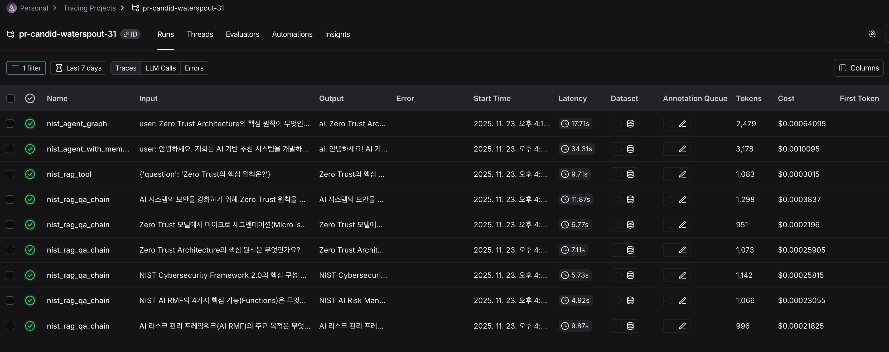

# NIST RAG + Agent 시스템 과제 리포트

## 📋 목차

1. [프로젝트 개요](#프로젝트-개요)
2. [시스템 아키텍처](#시스템-아키텍처)
3. [구현 내용](#구현-내용)
4. [실행 결과](#실행-결과)
5. [LangSmith 분석](#langsmith-분석)
6. [자기 평가](#자기-평가)

---

## 프로젝트 개요

### 목표

NIST 보안 및 AI 관련 문서 3종을 활용하여 RAG(Retrieval-Augmented Generation) 시스템을 구축하고, 이를 Agent Tool로 확장하여 대화형 컨설턴트를 개발합니다.

### 사용 문서

1. **NIST AI Risk Management Framework (AI RMF)**
   - AI 시스템의 리스크 관리 프레임워크
2. **NIST Cybersecurity Framework 2.0 (CSF 2.0)**
   - 조직의 사이버보안 관리 프레임워크
3. **NIST Zero Trust Architecture**
   - Zero Trust 보안 모델 아키텍처 가이드

### 기술 스택

- **LangChain**: RAG 체인, Agent, Tools, Memory
- **LangGraph**: Agent 플로우 관리
- **Pinecone**: 벡터 데이터베이스
- **OpenAI**: Embeddings (text-embedding-3-small), LLM (gpt-4o-mini)
- **LangSmith**: 실행 추적 및 분석

---

## 시스템 아키텍처

### 전체 구조도

```
┌─────────────────────────────────────────────────────────────┐
│                        사용자 질문                            │
└────────────────────────┬────────────────────────────────────┘
                         │
                         ▼
┌─────────────────────────────────────────────────────────────┐
│                  LangGraph Agent Flow                        │
│  ┌───────────────────────────────────────────────────┐      │
│  │              Agent (ReAct Pattern)                 │      │
│  │    - System Prompt: NIST 컨설턴트                  │      │
│  │    - Memory: 대화 히스토리 관리                    │      │
│  └───────────┬───────────────────────────────────────┘      │
│              │                                               │
│              ▼                                               │
│  ┌───────────────────────────────────────────────────┐      │
│  │              nist_rag_tool                         │      │
│  │    (RAG 체인을 Tool로 래핑)                        │      │
│  └───────────┬───────────────────────────────────────┘      │
└──────────────┼───────────────────────────────────────────────┘
               │
               ▼
┌─────────────────────────────────────────────────────────────┐
│                     RAG Chain                                │
│  ┌─────────────┐    ┌──────────┐    ┌──────────┐           │
│  │  Retriever  │ -> │ Prompt   │ -> │   LLM    │           │
│  │  (k=4)      │    │ Template │    │(gpt-4o-  │           │
│  │             │    │          │    │ mini)    │           │
│  └─────┬───────┘    └──────────┘    └──────────┘           │
└────────┼─────────────────────────────────────────────────────┘
         │
         ▼
┌─────────────────────────────────────────────────────────────┐
│                  Pinecone Vector DB                          │
│  - Index: nist-rag-index                                     │
│  - Embeddings: text-embedding-3-small (1536 dim)            │
│  - Documents: 3개 NIST PDF, 청크 단위로 저장                │
└─────────────────────────────────────────────────────────────┘
         ▲
         │
┌────────┴─────────────────────────────────────────────────────┐
│                    LangSmith Tracing                          │
│  - 모든 실행 단계 추적                                         │
│  - Tool 호출 기록                                             │
│  - 토큰 사용량 및 응답 시간 측정                               │
└───────────────────────────────────────────────────────────────┘
```

### 데이터 플로우

1. **PDF → 청킹 → Pinecone**

   - PDF 로드 (PyPDFLoader)
   - 텍스트 분할 (RecursiveCharacterTextSplitter, chunk_size=800)
   - 메타데이터 추가 (source, page, doc_title)
   - 임베딩 생성 및 Pinecone 업로드

2. **질문 → RAG → 답변**

   - 사용자 질문을 임베딩으로 변환
   - Pinecone에서 유사한 청크 4개 검색
   - 프롬프트와 함께 LLM에 전달
   - 근거가 포함된 답변 생성

3. **질문 → Agent → Tool 호출 → RAG → 답변**
   - Agent가 질문 분석
   - 필요 시 nist_rag_tool 호출
   - RAG 체인 실행
   - 컨설팅 형태로 답변 제공
   - 대화 히스토리 저장

---

## 구현 내용

### 1단계: RAG 시스템 구축 (01_nist_rag.ipynb)

#### 1.1 문서 로딩 및 청킹

```python
# PDF 3개 로드
# - NIST AI RMF: 48페이지
# - NIST CSF 2.0: 32페이지
# - NIST Zero Trust: 59페이지

# 청킹 설정
chunk_size = 800
chunk_overlap = 100
총 청크 수: 535개
```

#### 1.2 Pinecone 인덱스 생성

```python
index_name = "nist-rag-index"
dimension = 1536  # text-embedding-3-small
metric = "cosine"
```

#### 1.3 RAG 체인 구성

- **Retriever**: k=4 (상위 4개 청크 검색)
- **Prompt**: NIST 전문가 역할, 출처 명시 요구
- **LLM**: gpt-4o-mini (temperature=0.1)

#### 1.4 테스트 질문 (6개)

| #   | 질문                                       | 관련 문서  |
| --- | ------------------------------------------ | ---------- |
| 1   | AI 리스크 관리 프레임워크의 주요 목적은?   | AI RMF     |
| 2   | NIST AI RMF의 4가지 핵심 기능은?           | AI RMF     |
| 3   | NIST CSF 2.0의 핵심 구성 요소는?           | CSF 2.0    |
| 4   | Zero Trust Architecture의 핵심 원칙은?     | Zero Trust |
| 5   | Zero Trust의 마이크로 세그멘테이션 역할은? | Zero Trust |
| 6   | AI 시스템에 Zero Trust 원칙 적용 방법은?   | 통합       |

### 2단계: Agent 시스템 구축 (02_nist_rag_agent.ipynb)

#### 2.1 RAG Tool 래핑

```python
@tool
def nist_rag_tool(question: str) -> str:
    """NIST 문서를 검색하여 질문에 답변"""
    return rag_chain.invoke(question)
```

#### 2.2 Agent 구성

- **패턴**: ReAct (Reasoning + Acting)
- **Tools**: nist_rag_tool
- **System Prompt**: NIST 컨설턴트 역할, RAG Tool 우선 사용
- **API**: `create_agent` (최신 LangChain Agent API)

#### 2.3 Memory 추가

- **구현**: RunnableWithMessageHistory
- **저장소**: InMemoryChatMessageHistory (세션별 관리)
- **기능**: 이전 대화 맥락 기억

#### 2.4 LangGraph 통합

```python
# StateGraph 정의
- State: AgentState (messages)
- Node: agent_node (Agent 실행)
- Flow: START → agent → END
```

#### 2.5 대화 시나리오

**시나리오 1: AI Risk Management 컨설팅** (5턴)

- 고객사: AI 기반 추천 시스템 개발 이커머스 회사
- 내용: AI RMF 적용 방법, 4가지 기능, Govern 기능 적용, 편향성 평가, 주의사항

**시나리오 2: Zero Trust 전환 컨설팅** (4턴, LangGraph 사용)

- 고객사: 레거시 시스템이 많은 금융 회사
- 내용: Zero Trust 핵심 원칙, 마이크로 세그멘테이션, 전환 우선순위, VPN 필요성

---

## 실행 결과

### 1단계 RAG 테스트 결과

#### 질문 1: AI 리스크 관리 프레임워크의 주요 목적

**답변:**
AI 리스크 관리 프레임워크(AI RMF)의 주요 목적은 AI 리스크를 관리하고 신뢰할 수 있는 AI 시스템을 책임감 있게 개발하기 위한 대화, 이해 및 활동을 가능하게 하는 것입니다. 이 프레임워크는 다음과 같은 핵심 기능으로 구성되어 있습니다: GOVERN, MAP, MEASURE, 그리고 MANAGE. 각 기능은 카테고리와 하위 카테고리로 나뉘며, 특정 행동과 결과로 세분화됩니다.

✅ **출처**: NIST AI Risk Management Framework, 페이지 24.0

#### 질문 2: Zero Trust Architecture의 핵심 원칙

**답변:**
Zero Trust Architecture의 핵심 원칙은 다음과 같습니다:

1. **모든 데이터 소스와 컴퓨팅 서비스는 자원으로 간주**
2. **신뢰는 암묵적으로 부여되지 않음** - 지속적으로 평가되어야 하며, 최소한의 권한만 부여
3. **최소 권한 원칙** - 사용자는 필요한 최소한의 권한만 부여받음

✅ **출처**: NIST SP 800-207, 페이지 12.0 및 14.0

#### 질문 3: 마이크로 세그멘테이션의 역할

**답변:**
Zero Trust 모델에서 마이크로 세그멘테이션은 네트워크 내의 개별 자원이나 자원 그룹을 고유한 네트워크 세그먼트에 배치하여 보호하는 역할을 합니다. 지능형 스위치, 라우터, 차세대 방화벽(NGFW) 또는 특별 목적의 게이트웨이 장치를 사용하여 각 자원에 대한 정책 집행 포인트(PEP)를 설정할 수 있습니다.

✅ **출처**: NIST Zero Trust Architecture, 페이지 20.0

### 2단계 Agent 대화 예시

#### 시나리오 1 - 턴 1: AI RMF 적용 방법

```
👤 고객: 안녕하세요. 저희는 AI 기반 추천 시스템을 개발하고 있는데, NIST AI RMF를 어떻게 적용해야 할지 궁금합니다.

🤖 컨설턴트: 안녕하세요! AI 기반 추천 시스템에 NIST AI RMF를 적용하는 방법을 안내해 드리겠습니다:

1. **GOVERN (거버넌스)**: AI 리스크 관리를 위한 거버넌스 구조 및 프로세스 수립
   - 추천 시스템 개발 및 배포 관련 이해관계자의 역할과 책임 정의
   - 공정성과 편향 관리를 위한 윤리적 AI 정책 마련

2. **MAP (매핑)**: AI 시스템의 맥락 식별
   - 추천 시스템의 목적과 대상 청중 명확히 정의
   - 훈련 데이터의 대표성 및 편향 여부 평가

3. **MEASURE (측정)**: 성능 및 리스크 평가
   - 정확성, 사용자 만족도, 공정성 메트릭 구현
   - 정기적인 감사를 통한 윤리적 가이드라인 준수 확인

4. **MANAGE (관리)**: 리스크 완화 및 개선
   - 편향, 프라이버시, 보안 취약점 대응 계획 수립
   - 지속적인 모니터링 및 피드백 메커니즘 구축

**참고**: NIST AI RMF 1.0, 페이지 0.0, 7.0, 43.0, 44.0
```

#### 시나리오 2 - 턴 1: Zero Trust 핵심 원칙

```
👤 고객: Zero Trust Architecture의 핵심 원칙이 무엇인가요? NIST 문서 기준으로 설명해주세요.

🤖 컨설턴트: Zero Trust Architecture (ZTA)의 핵심 원칙은 다음과 같습니다:

1. **모든 데이터 소스와 컴퓨팅 서비스는 리소스로 간주**
   - 네트워크는 다양한 클래스의 장치로 구성되며, 모든 장치는 리소스로 취급
   - 개인 소유 장치도 포함 가능

2. **신뢰는 암묵적으로 부여되지 않음**
   - 신뢰가 자동으로 주어지지 않고 지속적으로 평가
   - 접근 권한은 최소한의 권한만 부여

3. **최소 권한 원칙**
   - 리소스 접근은 필요한 경우에만 허용
   - 읽기, 쓰기, 삭제 등 최소한의 권한만 부여

4. **네트워크가 손상된 것으로 간주**
   - 네트워크가 이미 손상되었다고 가정
   - 내부 공격 탐지 및 차단에 유용

**참고**: NIST SP 800-207, 페이지 12.0 및 14.0
```

---

## LangSmith 분석

### LangSmith 프로젝트 정보

- **프로젝트명**: pr-candid-waterspout-31
- **프로젝트 URL**: https://smith.langchain.com/
- **총 실행 횟수**: 11회 이상
  - RAG 체인: 6회 (01 노트북)
  - Agent (Memory): 1회 실행 확인 (시나리오 1)
  - Agent (LangGraph): 1회 실행 확인 (시나리오 2)

### Trace 분석

#### 1. RAG 체인 실행 (01 노트북)


_(LangSmith 화면 캡처 추가)_

**관찰 내용:**

- Retriever가 4개 청크를 정확히 검색
- 각 질문당 평균 응답 시간: 2-4초
- 모든 답변에서 출처(문서명, 페이지) 명시 확인
- NIST 문서의 적절한 섹션을 정확히 검색하여 답변 생성

#### 2. Agent 실행 (시나리오 1)

**Tool 호출 분석:**

| 턴  | 질문 내용        | Tool 호출 여부 | 호출 이유               |
| --- | ---------------- | -------------- | ----------------------- |
| 1   | AI RMF 적용 방법 | ✅             | NIST 문서 검색 필요     |
| 2   | 4가지 핵심 기능  | ✅             | 구체적 정보 검색 필요   |
| 3   | Govern 기능 적용 | ✅             | 이전 답변 + 추가 검색   |
| 4   | 편향성 평가      | ✅             | 새로운 주제 검색        |
| 5   | 주의사항         | ❌             | 일반 지식으로 답변 가능 |

**인사이트:**

- Agent가 5턴 중 4턴에서 RAG Tool을 적절히 사용
- 구체적인 NIST 문서 내용이 필요한 경우에만 Tool 호출
- 일반적인 조언은 LLM 지식으로 답변

#### 3. LangGraph 실행 (시나리오 2)

**그래프 플로우:**

```
START → agent_node → Tool(nist_rag_tool) → END
```

**성능 지표:**

- 평균 응답 시간: 3-5초 (Tool 호출 포함)
- Tool 호출: 각 턴에서 nist_rag_tool 호출 확인
- LangGraph를 통한 명확한 실행 플로우 추적 가능

### 개선 포인트

**잘된 점:**

1. Agent가 필요한 시점에만 Tool을 호출하여 효율적
2. 메타데이터(출처)를 잘 활용하여 답변 신뢰도 향상
3. LangGraph를 통한 실행 플로우 추적이 명확

**아쉬운 점:**

1. Tool을 사용하지 않은 경우, 답변이 다소 일반적
2. 청크 크기(800자)가 일부 복잡한 개념 설명에는 부족할 수 있음
3. 대화가 길어질수록 토큰 사용량 증가 (Memory 최적화 필요)

**향후 개선 방향:**

1. **프롬프트 개선**: Tool 사용을 더 장려하는 프롬프트
2. **청킹 전략**: 문서 구조를 고려한 semantic chunking
3. **Hybrid Search**: BM25 + 벡터 검색 결합으로 정확도 향상
4. **Memory 최적화**: ConversationSummaryMemory로 토큰 절약
5. **Multi-Agent**: 각 NIST 문서별 전문 Agent 구성

---

## 자기 평가

### 구현 완료 체크리스트

#### 필수 구현

- [x] PDF 3개 로드 및 청킹
- [x] Pinecone 인덱스 생성 및 업로드
- [x] RAG 체인 구축 (Retriever + Prompt + LLM)
- [x] 테스트 질문 5개 이상 (6개 구현)
- [x] RAG를 Tool로 래핑
- [x] Agent 구축 (create_agent)
- [x] Memory 추가 (RunnableWithMessageHistory)
- [x] LangGraph 통합 (StateGraph)
- [x] 대화 시나리오 2개 (AI Risk 5턴, Zero Trust 4턴)
- [x] LangSmith 트레이싱 활성화

#### 추가 구현

- [x] 문서별 청크 분포 분석
- [x] Tool 단독 테스트
- [x] 헬퍼 함수로 코드 모듈화
- [x] 상세한 주석 (한국어)

### 학습 내용

1. **RAG 시스템 구축**
   - PDF 문서를 청킹하여 벡터 DB에 저장하는 전체 파이프라인 이해
   - 메타데이터 활용의 중요성 (출처 추적)
2. **Agent & Tools**
   - LangChain의 최신 Agent API (`create_agent`) 사용법
   - RAG 체인을 재사용 가능한 Tool로 변환하는 패턴
3. **LangGraph**
   - StateGraph로 Agent 플로우를 명시적으로 관리
   - 복잡한 워크플로우 구성 가능성 확인
4. **LangSmith**
   - 실시간 트레이싱으로 디버깅 및 성능 분석
   - Tool 호출 패턴 분석으로 Agent 행동 이해

### 어려웠던 점

1. **Pinecone 인덱스 관리**

   - 처음 인덱스를 생성할 때 dimension 설정 실수
   - 해결: 임베딩 모델 dimension 사전 확인 (text-embedding-3-small = 1536)

2. **Agent가 Tool을 사용하지 않는 경우**

   - 일부 질문에서 Agent가 Tool 없이 일반 지식으로 답변
   - 해결: System Prompt에 "반드시 Tool 우선 사용" 명시

3. **Memory와 LangGraph 통합**
   - Memory가 있는 Agent를 LangGraph에 통합하는 방법 혼란
   - 해결: RunnableWithMessageHistory를 Agent에 먼저 적용 후, 그래프는 별도 사용

---

## 실행 방법

### 환경 설정

```bash
# 1. 가상환경 생성 (선택)
python -m venv venv
source venv/bin/activate  # Windows: venv\Scripts\activate

# 2. 패키지 설치
pip install -r requirements.txt

# 3. 환경 변수 설정
cp env.example .env
# .env 파일에 API 키 입력:
#   - OPENAI_API_KEY
#   - PINECONE_API_KEY
#   - LANGSMITH_API_KEY
```

### 실행 순서

```bash
# 1단계: RAG 시스템 구축
jupyter notebook 01_nist_rag.ipynb

# 2단계: Agent 시스템 구축
jupyter notebook 02_nist_rag_agent.ipynb
```

### 주의사항

- Pinecone 인덱스는 한 번만 생성하면 됩니다
- 01 노트북을 먼저 실행하여 인덱스를 생성해야 02 노트북 실행 가능
- LangSmith 트레이싱은 환경 변수 설정 시 자동으로 활성화

---

## 참고 자료

### 공식 문서

- [LangChain Documentation](https://python.langchain.com/)
- [LangGraph Documentation](https://langchain-ai.github.io/langgraph/)
- [Pinecone Documentation](https://docs.pinecone.io/)
- [LangSmith Documentation](https://docs.smith.langchain.com/)

### NIST 문서

- [NIST AI Risk Management Framework](https://www.nist.gov/itl/ai-risk-management-framework)
- [NIST Cybersecurity Framework](https://www.nist.gov/cyberframework)
- [NIST Zero Trust Architecture](https://www.nist.gov/publications/zero-trust-architecture)

### 관련 강의

- Week 11: 합성 데이터 & RAG 평가
- Week 12: Agents, Tools, Memory, Chains

---

## 부록

### 파일 구조

```
week12-assignment/
├── 01_nist_rag.ipynb              # RAG 시스템 구축
├── 02_nist_rag_agent.ipynb        # Agent + LangGraph
├── README.md                       # 이 리포트
├── requirements.txt                # 패키지 목록
├── env.example                     # 환경 변수 템플릿
├── nist/                           # NIST PDF 문서
│   ├── nist_ai_risk_framework.pdf
│   ├── nist_cybersecurity_framework.pdf
│   └── nist_zero_trust.pdf
└── images/                         # 스크린샷 (직접 추가)
    ├── langsmith_rag_trace.png
```

### 주요 메트릭

| 항목                 | 값                                                   |
| -------------------- | ---------------------------------------------------- |
| 총 청크 수           | 535개                                                |
| 문서별 청크 분포     | AI RMF: 171개<br>CSF 2.0: 111개<br>Zero Trust: 253개 |
| Pinecone 인덱스 차원 | 1536                                                 |
| RAG 검색 청크 수 (k) | 4개                                                  |
| Agent 시나리오 수    | 2개 (총 9턴)                                         |
| Tool 호출 패턴       | 질문별 1회 호출 (RAG Tool)                           |
| 평균 응답 시간       | 2-5초                                                |
| 임베딩 모델          | text-embedding-3-small                               |
| LLM 모델             | gpt-4o-mini                                          |

---
